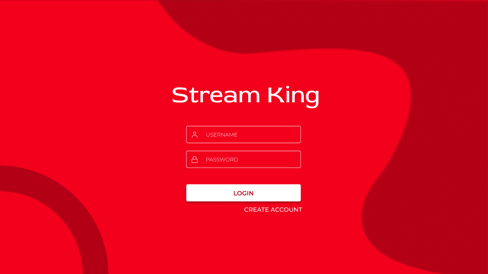
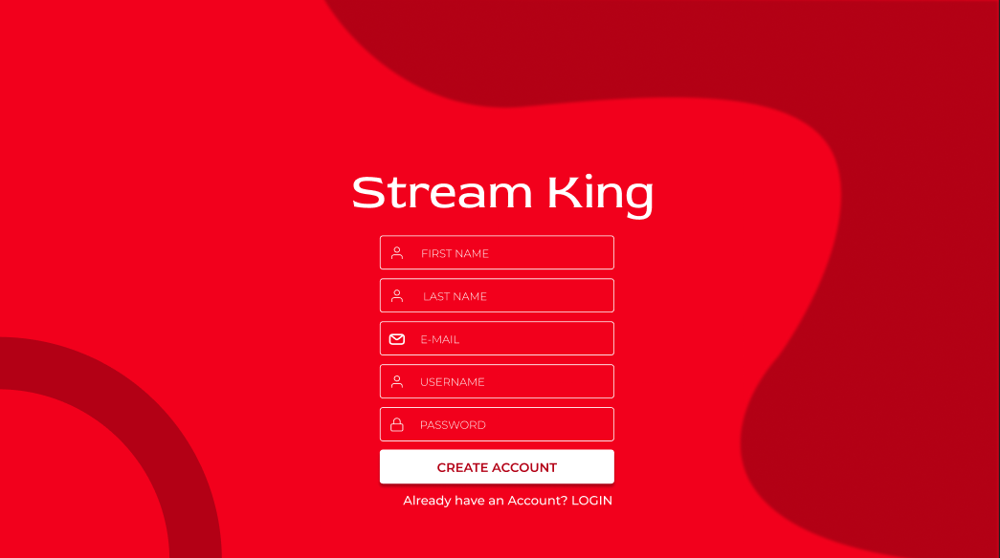
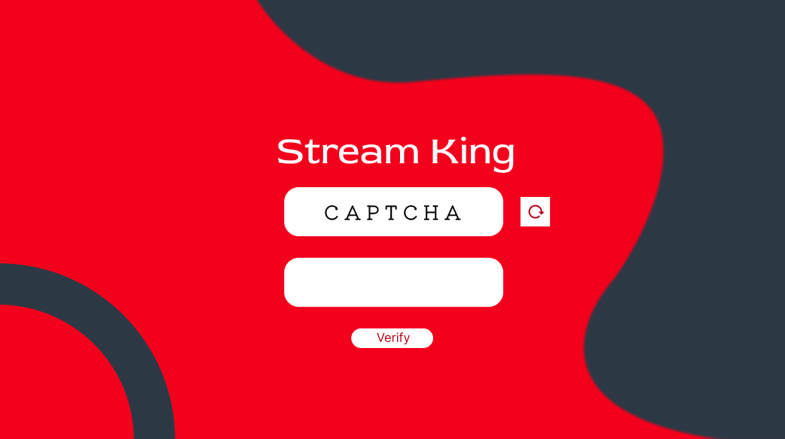
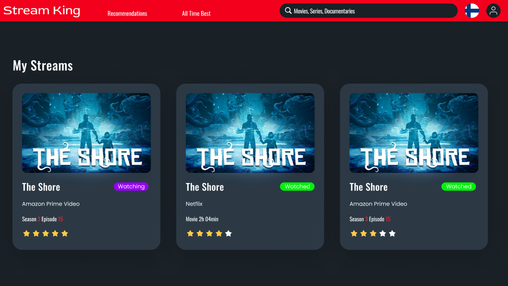
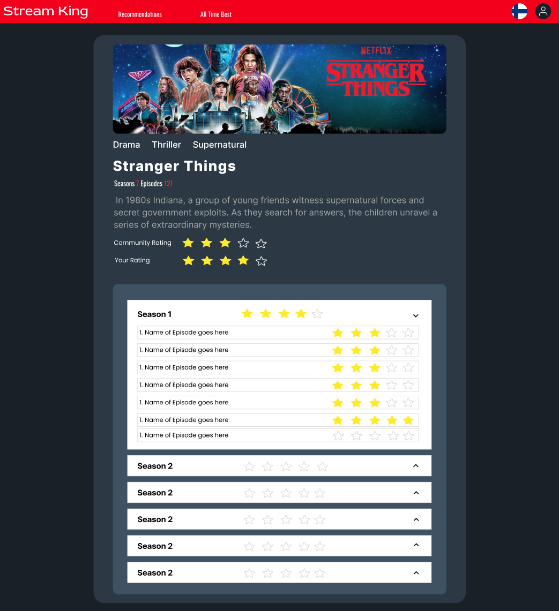
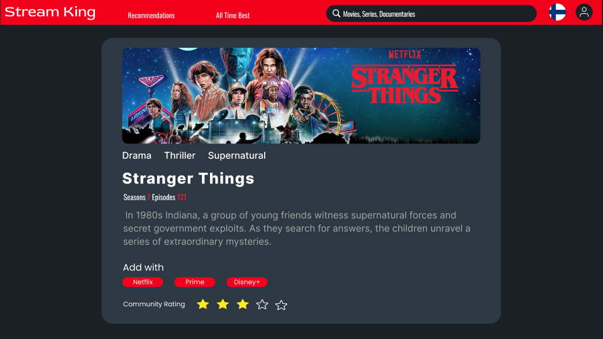
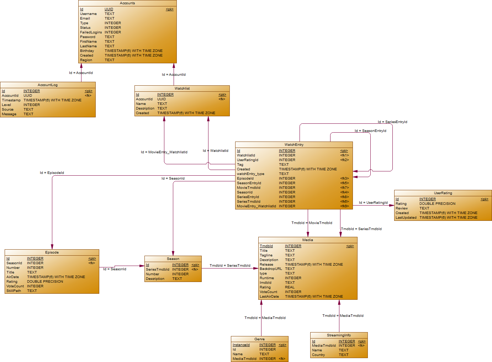

# .NET Framework and C# - Project work - Group 1
## Table of Contents
<ol>
  <li>
    <a href="#about-the-project">About The Project</a>
    <ul>
      <li><a href="#contributors">Contributors</a></li>
      <li><a href="#built-with">Built With</a></li>
    </ul>
  </li>
  <li>
    <a href="#setup-process">Setup Process</a>
  </li>
  <li>
    <a href="#description">Description</a>
    <ul>
      <li><a href="#mockup">Mockup</a></li>
      <li><a href="#er-model">ER Model</a></li>
      <li><a href="#dump-file">Dump File</a></li>
      <li><a href="#postman-collection">Postman Collection</a></li>
    </ul>
  </li>
</ol>
 

<!-- ABOUT THE PROJECT -->
## About The Project
This repository contains the group project for the course **.Net Framework and C#** at the university of applied sciences in Darmstadt, Germany. 

The application consists of a backend [WebAPI](https://dotnet.microsoft.com/en-us/apps/aspnet/apis), a frontend [WPF](https://docs.microsoft.com/en-us/dotnet/desktop/wpf/?view=netdesktop-6.0)  client and a [postgreSQL](https://www.postgresql.org/docs/) database for data storage. 
### Contributors
Student members of project group:
- [Toubeyas (Abel, Tobias)](https://github.com/Toubeyas) 
- [Iron-Mike-Tyson (de Riese-Meyer, Kevin)](https://github.com/Iron-Mike-Tyson) 
- [T-hai (Quang Thai Vu)](https://github.com/T-hai) 

Lecturer:
- [alaluuk (Alaluukas, Pekka)](https://github.com/alaluuk)
### Built With
This chapter contains a list of all technologies that are being used in this project. 
#### Frameworks
- [.NET 6.0](https://docs.microsoft.com/en-us/dotnet/?WT.mc_id=dotnet-35129-website) for class library and frontend
- [ASP.NET Core 6.0](https://docs.microsoft.com/en-us/aspnet/core/?view=aspnetcore-6.0) for backend
- [MSTest](https://docs.microsoft.com/en-us/dotnet/core/testing/unit-testing-with-mstest) for unit testing

#### Security
- Authorization of WebAPI with [JWT](https://jwt.io/introduction)
#### Services
- [Central postgresql server](https://code.fbi.h-da.de/lab-docs/db/-/wikis/postgresql/Zentraler-PostgreSQL-Server) from [h_da](https://h-da.de/en/) as a database (german documentation)
- [The Movie Database API](https://developers.themoviedb.org/3) is used to retrieve initial Media and Series objects and their Streaming Availability
  
<!-- Setup Process -->
## Setup Process
(how to install the application, so that a new developer can start to work)
These are the Steps you need to take to develop with this application:
1. Clone repository
2. Open project in Visual Studio 2022 and Build the solution or run "dotnet build solution.sln -c Release" in a shell
3. Start WebAPI backend by going into the StreamKing.Web folder and running "dotnet run -c Release --no-build" (--no-build is recommended so this process does not block any dll files from being used in other builds). You will be asked to login to the API (Username: streamking, Password: 7dyAvoCqTkmVqKNu5c9eX3wg) and then login to the database (Username: dotnet, Password:{ask us for the password privately, this is our live database, so we do not want to give out the password in the ReadMe.md}). The backend then is started on https://localhost:9595 and hosts the swagger files at [https://localhost:9595/swagger/index.html](https://localhost:9595/swagger/index.html).
4. Start Frontend by executing the previously built exe File, which can be found at (StreamKing\bin\Release\net6.0-windows\streamking.exe). 
5. Admin account credentials are Username: admin, Password: admin9876
6. Have fun!

<!-- DESCRIPTION -->
## Description
The StreamKing Application is used to get Streaming Availability Informations for many Movies & Series in the Regions 
USA, Germany and Finland. You are also able 
to save these to your own personal Watchlist which is linked to your Account and is then being saved in our central 
Database.

### Mockup
#### Login View

#### Create Account View

#### Captcha View

#### Landing Page View

#### Search results View

#### Detail View Series

#### Detail View Movie

### ER Model
This is the ER-Model for the PSQL Database, which was created with the help of the SAP PowerDesigner. 
We didn't use the automatically created versions, e.g. from pgAdmin, because they weren't really readable and 
we had more freedom with this tool.

### Dump File
[SQL Dump File](docs/StreamKingSQLDumpFile.sql) (From: 09.09.2022 00:10 AM) which was created with the pgAdmin PSQL Tool.

### Postman Collection
[Postman Collection](docs/dotnet_Project_API.postman_collection.json) (From: 09.09.2022 09:143 AM) which was created with Postman and used for API testing.
